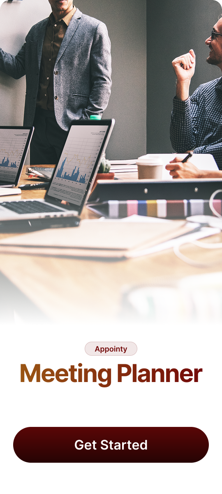
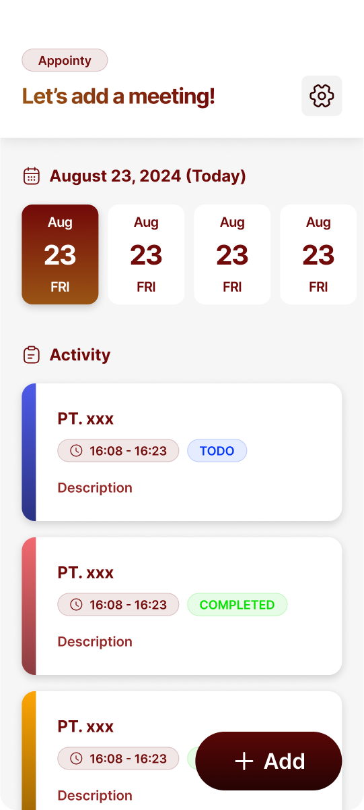

# Appointy Meeting Planner

  
  &nbsp;&nbsp;
  

Appointy Meeting Planner is designed to simplify your meeting planning process. With an intuitive interface and elegant design, the app allows you to add, edit or delete meeting details and company information with ease. Enjoy a more efficient and organized meeting planning experience.

🔮 **Future Developments:**
The app will be integrated with an API so that meeting schedules can be sent via notifications to each user when the meeting is about to start, ensuring no meetings are missed.

## Getting Started

This project is a starting point for a Flutter application.

A few resources to get you started if this is your first Flutter project:

- [Lab: Write your first Flutter app](https://docs.flutter.dev/get-started/codelab)
- [Cookbook: Useful Flutter samples](https://docs.flutter.dev/cookbook)

For help getting started with Flutter development, view the
[online documentation](https://docs.flutter.dev/), which offers tutorials,
samples, guidance on mobile development, and a full API reference.
